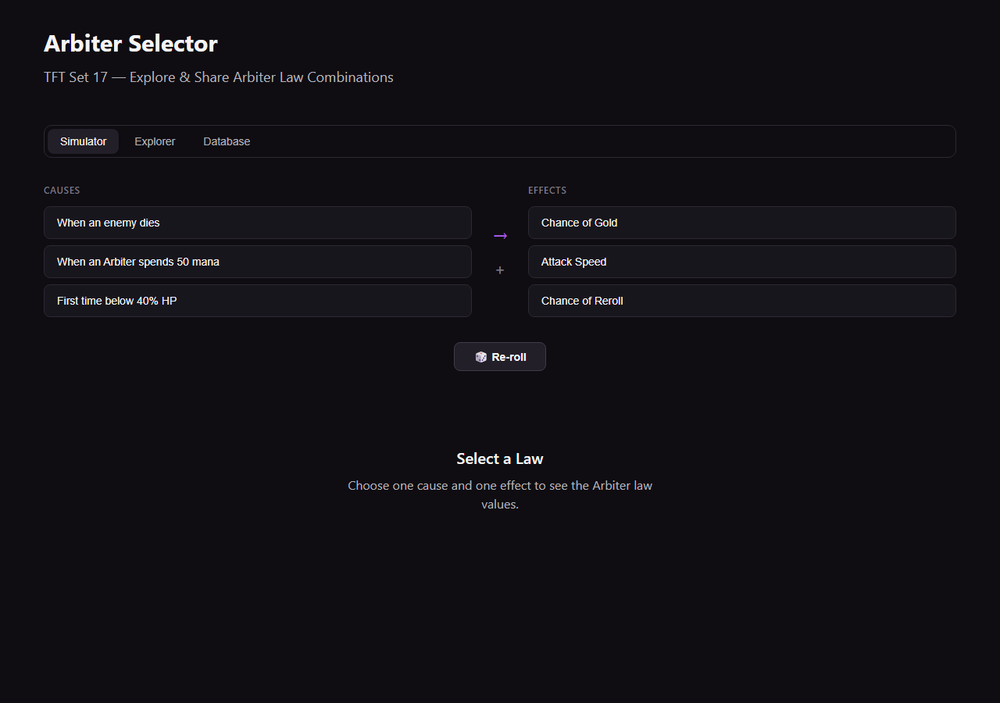
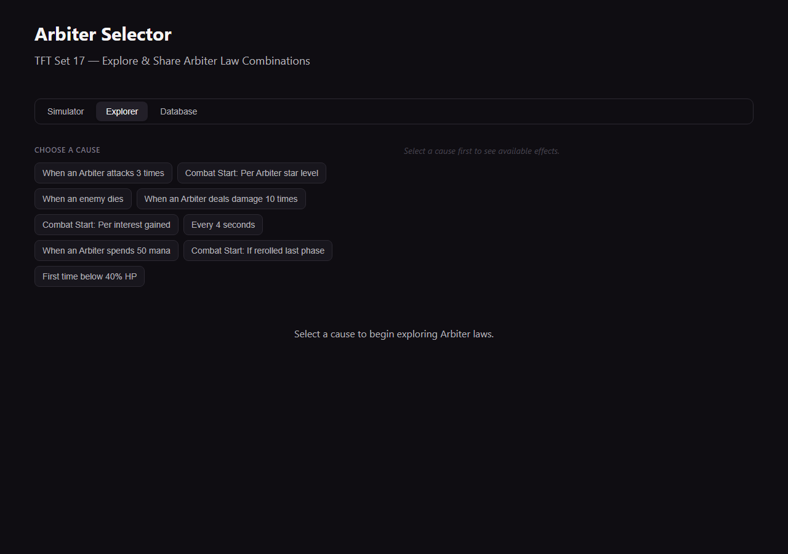
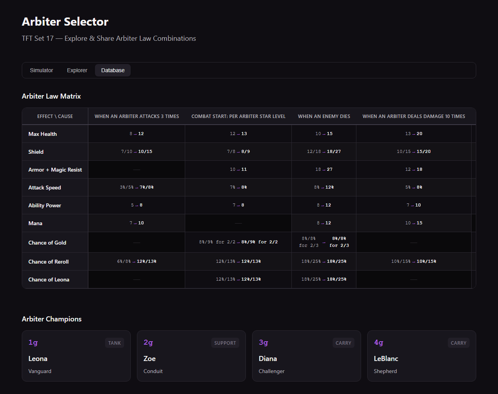

# Arbiter Selector — TFT Set 17

> 🌐 [English](README.md)

Una herramienta web para explorar y experimentar con el rasgo **Sentencia** (*Arbiter*) del Set 17 de Teamfight Tactics.

## ¿Qué es esto?

En TFT Set 17, el rasgo Sentencia te permite crear "leyes divinas" combinando **causas** con **efectos** en una matriz de 9×9. Hay 72 combinaciones válidas — y recordarlas todas durante la partida es un dolor de cabeza.

Esta herramienta lo pone todo a tu alcance: simula una tirada aleatoria, explora combinaciones libremente, o consulta la base de datos completa.

## Funcionalidades

**🎲 Simulador**  
Tira 3 causas y 3 efectos al azar — igual que en una partida real. Elige una combinación y ve sus valores para 2 Sentencias (tier 2) y 3 Sentencias (tier 3). Si no te gusta la mano, haz clic en re-roll.

**🔍 Explorador**  
Selecciona cualquier causa de las 9 disponibles y descubre qué efectos son válidos. Comparte combinaciones específicas mediante URL: `?cause=attacks-3x&effect=max-health`. Incluye botón para copiar el enlace.

**📊 Base de Datos**  
Matriz 9×9 completa con todas las combinaciones válidas e inválidas, más las fichas de los 4 campeones Sentencia (Leona, Zoe, Diana, LeBlanc).

## Capturas de pantalla





## Tecnologías

| Capa | Tecnología |
|------|------------|
| Framework | React 19 + TypeScript |
| Build | Vite 6 |
| Estilos | CSS vanilla (tema oscuro) |
| Testing | Vitest (26 pruebas) |
| Bundle | ~68 KB gzip |

## Cómo empezar

```bash
npm install
npm run dev       # inicia el servidor de desarrollo
npm run build     # build de producción → dist/
npm test          # ejecuta las pruebas
```

## Demo en vivo

Disponible en GitHub Pages: [ajeco1na.github.io/arbiter-selector](https://ajeco1na.github.io/arbiter-selector/)

---

Parche 17.2. Hecho para ahorrarte cálculos mentales durante tus partidas.
